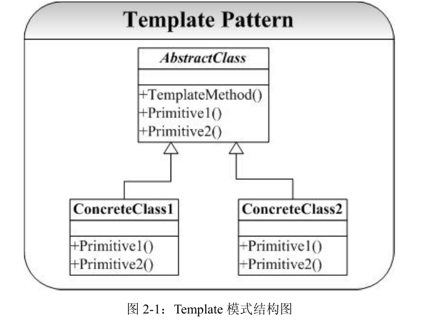

# Template-模板模式
## 概念
定义一个操作中算法的骨架，而将一些步骤延迟到子类中，模板方法使得子类可以不改变算法的结构即可重定义该算法的某些特定步骤。  

通俗点的理解就是 ：完成一件事情，有固定的数个步骤，但是每个步骤根据对象的不同，而实现细节不同；就可以在父类中定义一个完成该事情的总方法，按照完成事件需要的步骤去调用其每个步骤的实现方法。每个步骤的具体实现，由子类完成。  

## 类图
   

抽象父类（AbstractClass）：实现了模板方法，定义了算法的骨架。  
具体类（ConcreteClass)：实现抽象类中的抽象方法，即不同的对象的具体实现细节。 

Template 模式实际上就是利用面向对象中多态的概念实现算法实现细节和高层接口的
松耦合。可以看到 Template 模式采取的是继承方式实现这一点的，由于继承是一种强约束
性的条件，因此也给 Template 模式带来一些许多不方便的地方

## 优点
1. 具体细节步骤实现定义在子类中，子类定义详细处理算法是不会改变算法整体结构。
2. 代码复用的基本技术，在数据库设计中尤为重要。
3. 通过一个父类调用其子类的操作，通过子类对父类进行扩展增加新的行为，符合“开闭原则”。 

## 缺点
每个不同的实现都需要定义一个子类，会导致类的个数增加，系统更加庞大。

## 讨论
Template 模式是很简单模式，但是也应用很广的模式。如上面的分析和实现中阐明的
Template 是采用继承的方式实现算法的异构，其关键点就是将通用算法封装在抽象基类中，
并将不同的算法细节放到子类中实现。  

Template 模式获得一种反向控制结构效果，这也是面向对象系统的分析和设计中一个原
则 DIP（依赖倒置：Dependency Inversion Principles）。其含义就是父类调用子类的操作（高
层模块调用低层模块的操作），低层模块实现高层模块声明的接口。这样控制权在父类（高
层模块），低层模块反而要依赖高层模块。

## 参考网址
https://www.cnblogs.com/qq-361807535/p/6854191.html  