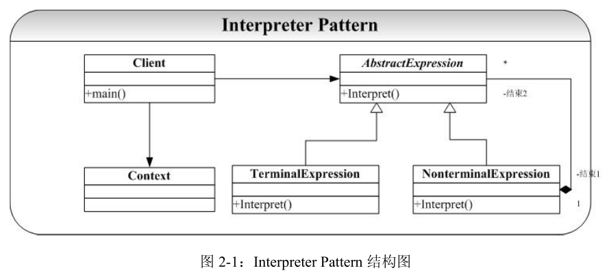

# Interpreter-解释器模式

## 概念
解释器模式（Interpreter），给定一个语言，定义它的文法的一种表示，并定义一个解释器，这个解释器使用该表示来解释语言中的句子。

## 类图
  

角色:  
1. 抽象表达式角色(AbstractExpression)： 声明一个抽象的解释操作，这个接口为所有具体表达式角色都要实现的。
2. 终结符表达式角色(TerminalExpression)： 实现与文法中的元素相关联的解释操作，通常一个解释器模式中只有一个终结符表达式，但有多个实例对应不同的终结符，
3. 终结符就是语言中用到的基本元素：一般不能再被分解，如: x -> xa， 这里a是终结符，因为没有别的规则可以把a变成别的符号，不过x可以变成别的符号，所以x是非终结符。
4. 非终结符表达式角色(NonterminalExpression)： 文法中的每条规则对应于一个非终结表达式， 非终结表达式根据逻辑的复杂程度而增加，原则上每个文法规则都对应一个非终结符表达式。
5. 环境角色(Context)：包含解释器之外的一些全局信息。
