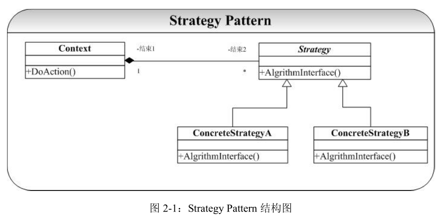

# Strategy-策略模式

## 概念
策略模式定义了一系列的算法，并将每一个算法封装起来，使每个算法可以相互替代，使算法本身和使用算法的客户端分割开来，相互独立。  

Strategy 模式和 Template 模式要解决的问题是相同（类似）的，都是为了给业务逻辑（算
法）具体实现和抽象接口之间的解耦。Strategy 模式将逻辑（算法）封装到一个类（Context）
里面，通过组合的方式将具体算法的实现在组合对象中实现，再通过委托的方式将抽象接口
的实现委托给组合对象实现。  

## 类图
  

1. 抽象策略角色这个是一个抽象的角色，通常情况下使用接口或者抽象类去实现。
2. 具体策略角色包装了具体的算法和行为。
3. 环境角色内部会持有一个抽象角色的引用，给客户端调用。

## 深入理解策略模式：

策略模式的作用：就是把具体的算法实现从业务逻辑中剥离出来，成为一系列独立算法类，使得它们可以相互替换。

策略模式的着重点：不是如何来实现算法，而是如何组织和调用这些算法，从而让我们的程序结构更加的灵活、可扩展。

## 优点
1. 策略模式的功能就是通过抽象、封装来定义一系列的算法，使得这些算法可以相互替换，所以为这些算法定义一个公共的接口，以约束这些算法的功能实现。如果这些算法具有公共的功能，可以将接口变为抽象类，将公共功能放到抽象父类里面。
2. 策略模式的一系列算法是可以相互替换的、是平等的，写在一起就是if-else组织结构，如果算法实现里又有条件语句，就构成了多重条件语句，可以用策略模式，避免这样的多重条件语句。
3. 扩展性更好：在策略模式中扩展策略实现非常的容易，只要新增一个策略实现类，然后在使用策略实现的地方，使用这个新的策略实现就好了。

## 缺点
1. 客户端必须了解所有的策略，清楚它们的不同：
如果由客户端来决定使用何种算法，那客户端必须知道所有的策略，清楚各个策略的功能和不同，这样才能做出正确的选择，但是这暴露了策略的具体实现。
2. 增加了对象的数量：
由于策略模式将每个具体的算法都单独封装为一个策略类，如果可选的策略有很多的话，那对象的数量也会很多。

## 策略模式的本质：分离算法，选择实现。
如果你仔细思考策略模式的结构和功能的话，就会发现：如果没有上下文，策略模式就回到了最基本的接口和实现了，只要是面向接口编程，就能够享受到面向接口编程带来的好处，通过一个统一的策略接口来封装和分离各个具体的策略实现，无需关系具体的策略实现。

貌似没有上下文什么事，但是如果没有上下文的话，客户端就必须直接和具体的策略实现进行交互了，尤其是需要提供一些公共功能或者是存储一些状态的时候，会大大增加客户端使用的难度；引入上下文之后，这部分工作可以由上下文来完成，客户端只需要和上下文进行交互就可以了。这样可以让策略模式更具有整体性，客户端也更加的简单。

策略模式体现了开闭原则：策略模式把一系列的可变算法进行封装，从而定义了良好的程序结构，在出现新的算法的时候，可以很容易的将新的算法实现加入到已有的系统中，而已有的实现不需要修改。

策略模式体现了里氏替换原则：策略模式是一个扁平的结构，各个策略实现都是兄弟关系，实现了同一个接口或者继承了同一个抽象类。这样只要使用策略的客户端保持面向抽象编程，就可以动态的切换不同的策略实现以进行替换。