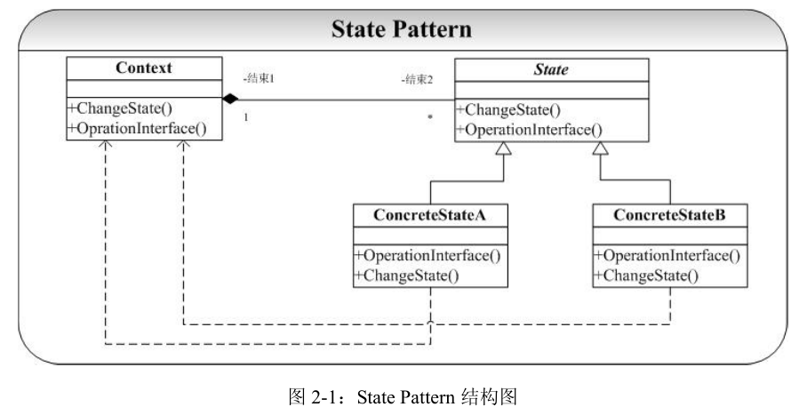

# State-状态模式

## 概念
有限状态自动机（FSM）也是一个典型的状态不同，对输入有不同的响应（状态转移）。
通常我们在实现这类系统会使用到很多的 Switch/Case 语句，Case 某种状态，发生什么动作，
Case 另外一种状态，则发生另外一种状态。但是这种实现方式至少有以下两个问题：  
1. 当状态数目不是很多的时候，Switch/Case 可能可以搞定。但是当状态数目很多的时
候（实际系统中也正是如此），维护一大组的 Switch/Case 语句将是一件异常困难并且容易出
错的事情。  
2. 状态逻辑和动作实现没有分离。在很多的系统实现中，动作的实现代码直接写在状
态的逻辑当中。这带来的后果就是系统的扩展性和维护得不到保证。  

State 模式就是被用来解决上面列出的两个问题的，在 State 模式中我们将状态逻辑和动
作实现进行分离。当一个操作中要维护大量的 case 分支语句，并且这些分支依赖于对象的
状态。State 模式将每一个分支都封装到独立的类中。  

## 类图
   
State 及其子类中的操作都将 Context*传入作为参数，其主要目的是 State 类可以通
过这个指针调用 Context 中的方法（在本示例代码中没有体现）。这也是 State 模式和 Strategy
模式的最大区别所在。

状态模式的角色：  
1. state状态：
表示状态，定义了根据不同状态进行不同处理的接口，该接口是那些处理内容依赖于状态的方法集合，对应实例的state类  
2. 具体的状态：
实现了state接口，对应daystate和nightstate  
3. context：
context持有当前状态的具体状态的实例，此外，他还定义了供外部调用者使用的状态模式的接口。  

## 优点
State 模式很好地实现了对象的状态逻辑和动作实现的分离，状态逻辑分布在 State 的派
生类中实现，而动作实现则可以放在 Context 类中实现（这也是为什么 State 派生类需要拥
有一个指向 Context 的指针）。这使得两者的变化相互独立，改变 State 的状态逻辑可以很容
易复用 Context 的动作，也可以在不影响 State 派生类的前提下创建 Context 的子类来更改或
替换动作实现。

## 缺点
State 模式问题主要是逻辑分散化，状态逻辑分布到了很多的 State 的子类中，很难看到
整个的状态逻辑图，这也带来了代码的维护问题。

## 讨论
State 模式和 Strategy 模式又很大程度上的相似：它们都有一个 Context 类，都是通过委
托（组合）给一个具有多个派生类的多态基类实现 Context 的算法逻辑。两者最大的差别就
是 State 模式中派生类持有指向 Context 对象的引用，并通过这个引用调用 Context 中的方法，
但在 Strategy 模式中就没有这种情况。因此可以说一个 State 实例同样是 Strategy 模式的一
个实例，反之却不成立。实际上 State 模式和 Strategy 模式的区别还在于它们所关注的点不
尽相同：State 模式主要是要适应对象对于状态改变时的不同处理策略的实现，而 Strategy
则主要是具体算法和实现接口的解耦（coupling），Strategy 模式中并没有状态的概念（虽然
很多时候有可以被看作是状态的概念），并且更加不关心状态的改变了。