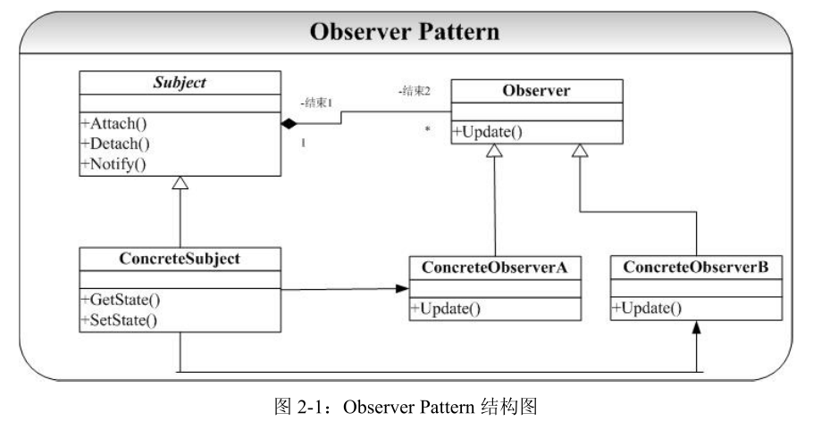

# Observer-观察者模式
## 概念
Observer 模式要解决的问题为：建立一个
一（Subject）对多（Observer）的依赖关系，并且做到当“一”变化的时候，依赖这个“一”
的多也能够同步改变。最常见的一个例子就是：对同一组数据进行统计分析时候，我们希望
能够提供多种形式的表示（例如以表格进行统计显示、柱状图统计显示、百分比统计显示等）。
这些表示都依赖于同一组数据，我们当然需要当数据改变的时候，所有的统计的显示都能够
同时改变。Observer 模式就是解决了这一个问题。

在 Java 语言中还提供了专门的接口实现 Observer
模式：通过专门的类 Observable 及 Observer 接口来实现 MVC 编程模式

## 类图
  
这里的目标 Subject 提供依赖于它的观察者 Observer 的注册（Attach）和注销（Detach）
操作，并且提供了使得依赖于它的所有观察者同步的操作（Notify）。观察者 Observer 则提
供一个 Update 操作，注意这里的 Observer 的 Update 操作并不在 Observer 改变了 Subject 目
标状态的时候就对自己进行更新，这个更新操作要延迟到 Subject 对象发出 Notify 通知所有
Observer 进行修改（调用 Update）。

