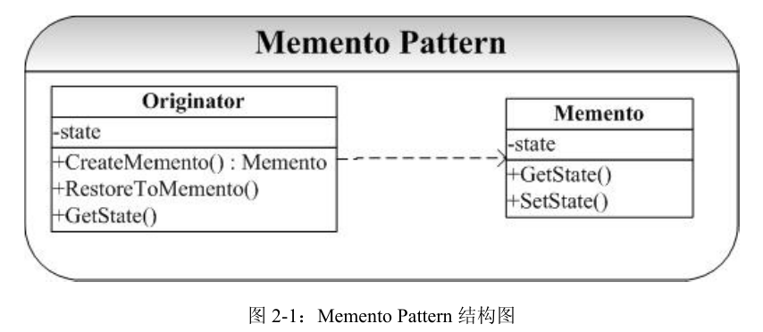

## Memento-备忘录模式

## 概念
在进行软件系统的设计时候是要给用户后悔的权利（实际上可能也是用户要求的权利：）），我们对一些关键性的操作肯定需要提供诸如撤销（Undo）的操作。那这就是 Memento 模式提供的。

Memento 模式的关键就是要在不破坏封装行的前提下，捕获并保存一个类的内部
状态，这样就可以利用该保存的状态实施恢复操作。

备忘录模式一般会提供两种接口：宽接口和窄接口。通过宽接口可以获取整个对象状态，会暴露备忘录对象的内部信息。通过窄接口，只能访问有限的，开发者限制了的信息，可以有效的防止信息泄露。

## 类图
  

* Originator(生成者)
Originator角色会在保存自己的最新状态时生成Memento角色。当把以前保存的Memento角色传递给Originator角色时，它会将自己恢复至生成该Memento角色时的状态。在案例中，由Gamer类扮演此角色。

* Memento(备忘录)
Memento角色会将Originator角色的内部信息整合在一起。在Memento角色中虽然保存了Originator角色的信息，但它不会向外部公开这些信息。 在Java语言中可以将两个类放在一个包中，使它们之间满足默认的包内可见性，也可以将备忘录类作为原发器类的内部类，使得只有原发器才可以访问备忘录中的数据，其他对象都无法使用备忘录中的数据。
Memento角色有以下两种接口（API）。
	1. wide interface——宽接口（API） 
	Memento角色提供的“宽接口（API）”是指所有用于获取恢复对象状态信息的方法的集合。由于宽接口（API）会暴露所有Memento角色的内部信息，因此能够使用宽接口（API）的只有Originator角色。
	2. narrow interface——窄接口（API） 
	Memento角色为外部的Caretaker角色提供了“窄接口（API）” 。可以通过窄接口（API）获取的Memento角色的内部信息、非常有限，因此可以有效地防止信息泄露。

## 优点
1. 提供了一种状态恢复的实现机制，使得用户可以方便地回到一个特定的历史步骤，当新的状态无效或者存在问题时，可以使用先前存储起来的备忘录将状态复原。
2. 实现了信息的封装，一个备忘录对象是一种原发器对象的表示，不会被其他代码改动，这种模式简化了原发器对象，备忘录只保存原发器的状态，采用堆栈来存储备忘录对象可以实现多次撤销操作，可以通过在负责人中定义集合对象来存储多个备忘录。

## 缺点
资源消耗过大，如果类的成员变量太多，就不可避免占用大量的内存，而且每保存一次对象的状态都需要消耗内存资源，如果知道这一点大家就容易理解为什么一些提供了撤销功能的软件在运行时所需的内存和硬盘空间比较大了。

参考网址:https://www.cnblogs.com/Bobby0322/p/4195735.html