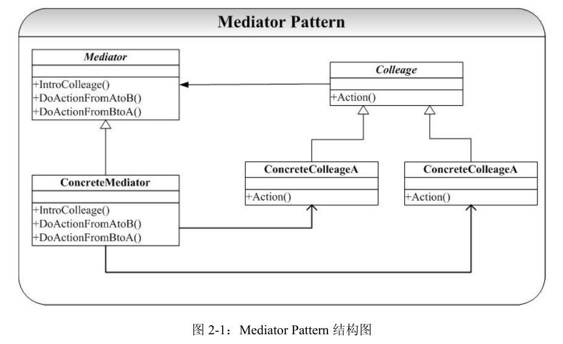

# Mediator-中介者模式

## 概念
在面向对象系统的设计和开发过程中，对象之间的交互和通信是最为常见的情况，因为
对象间的交互本身就是一种通信。在系统比较小的时候，可能对象间的通信不是很多、对象
也比较少，我们可以直接硬编码到各个对象的方法中。但是当系统规模变大，对象的量变引
起系统复杂度的急剧增加，对象间的通信也变得越来越复杂，这时候我们就要提供一个专门
处理对象间交互和通信的类，这个中介者就是 Mediator 模式。Mediator 模式提供将对象间
的交互和通讯封装在一个类中，各个对象间的通信不必显势去声明和引用，大大降低了系统
的复杂性能（了解一个对象总比深入熟悉 n 个对象要好）。另外 Mediator 模式还带来了系统
对象间的松耦合，这些将在讨论中详细给出。

这个中介者常常起着中间桥梁的作用，使其他的对象可以利用中介者完成某些行为活动，因此它必须对所有的参与活动的对象了如指掌！

## 类图
  

## 讨论
Mediator 模式是一种很有用并且很常用的模式，它通过将对象间的通信封装到一个类
中，将多对多的通信转化为一对多的通信，降低了系统的复杂性。Mediator 还获得系统解耦
的特性，通过 Mediator，各个 Colleague 就不必维护各自通信的对象和通信协议，降低了系
统的耦合性，Mediator 和各个 Colleague 就可以相互独立地修改了。  

Mediator 模式还有一个很显著额特点就是将控制集中，集中的优点就是便于管理，也正
式符合了 OO 设计中的每个类的职责要单一和集中的原则。

