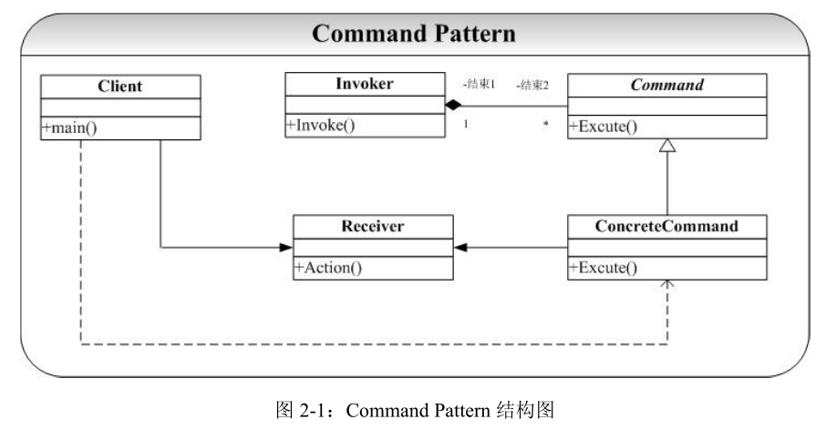

# Command-命令模式

## 概念
Command 模式通过将请求封装到一个对象（Command）中，并将请求的接受者存放到
具体的 ConcreteCommand 类中（Receiver）中，从而实现调用操作的对象和操作的具体实现
者之间的解耦。

## 类图
 

角色：  
Command：定义命令的统一接口  
ConcreteCommand：Command接口的实现者，用来执行具体的命令，某些情况下可以直接用来充当Receiver。  
Receiver：命令的实际执行者  
Invoker：命令的请求者，是命令模式中最重要的角色。这个角色用来对各个命令进行控制。  

Command 模式结构图中，将请求的接收者（处理者）放到 Command 的具体子类
ConcreteCommand 中，当请求到来时（Invoker 发出 Invoke 消息激活 Command 对象），
ConcreteCommand 将处理请求交给 Receiver 对象进行处理。

## 优点
1. Command 模式将调用操作的对象和知道如何实现该操作的对象解耦。在上面
Command 的结构图中，Invoker 对象根本就不知道具体的是那个对象在处理 Excute
操作（当然要知道是 Command 类别的对象，也仅此而已）。
2. 在 Command 要增加新的处理操作对象很容易，我们可以通过创建新的继承自
Command 的子类来实现这一点
3.Command 模式可以和 Memento 模式结合起来，支持取消的操作。

## 讨论
Command 模式的思想非常简单，但是 Command 模式也十分常见，并且威力不小。实
际上，Command 模式关键就是提供一个抽象的 Command 类，并将执行操作封装到 Command
类接口中，Command 类中一般就是只是一些接口的集合。主要目的就是实现调用者和执行者的解耦。
