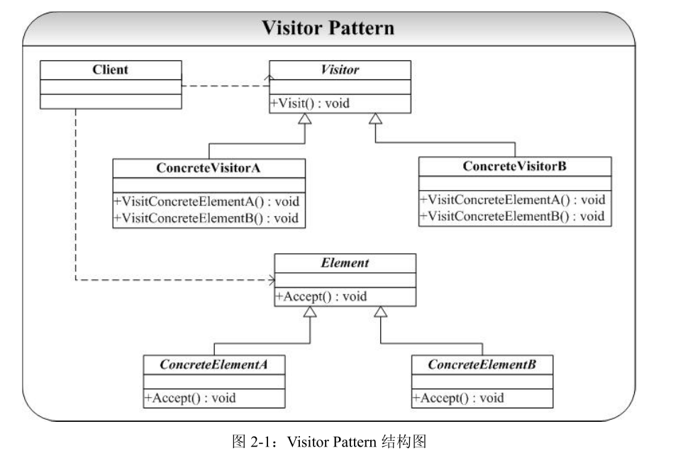

# visiter-访问者模式

## 概念
访问者模式是一种将数据操作与数据结构分离的设计模式，它可以算是 23 中设计模式中最复杂的一个，但它的使用频率并不是很高，大多数情况下，你并不需要使用访问者模式，但是当你一旦需要使用它时，那你就是需要使用它了。

访问者模式的基本想法是，软件系统中拥有一个由许多对象构成的、比较稳定的对象结构，这些对象的类都拥有一个 accept 方法用来接受访问者对象的访问。访问者是一个接口，它拥有一个 visit 方法，这个方法对访问到的对象结构中不同类型的元素做出不同的处理。在对象结构的一次访问过程中，我们遍历整个对象结构，对每一个元素都实施 accept 方法，在每一个元素的 accept 方法中会调用访问者的 visit 方法，从而使访问者得以处理对象结构的每一个元素，我们可以针对对象结构设计不同的访问者类来完成不同的操作，达到区别对待的效果。

## 类图
 