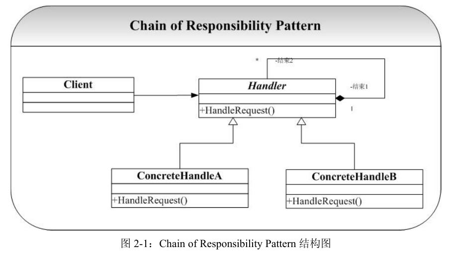

# Chain of Responsibility-责任链模式

## 概念
Chain of Responsibility 模式描述其实就是这样一类问题将可能处理一个请求的对象链接成一个链，并将请求在这个链上传递，直到有对象处理该请求（可能需要提供一个默认处
理所有请求类）.通过这样一种方式，避免了请求者和接收者之间的耦合。

责任链模式在面向对象程式设计里是一种软件设计模式，它包含了一些命令对象和一系列的处理对象。每一个处理对象决定它能处理哪些命令对象，它也知道如何将它不能处理的命令对象传递给该链中的下一个处理对象。该模式还描述了往该处理链的末尾添加新的处理对象的方法。

## 类图
 

## 优点
降低了耦合性，请求的发送者完全不必知道该请求会被哪个应答对象处理，极大地降低了系统的耦合性。

参考网址:https://www.jianshu.com/p/75946acd80e3

