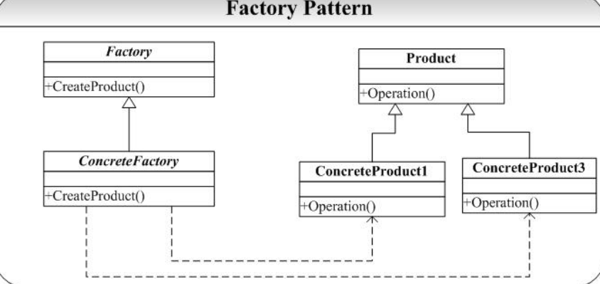

# 工厂设计模式
### 主要解决问题 
当一个接口有多个实现类时，会存在如下问题：  
1. 客户程序员必须知道实际子类的名称，当系统复杂后，命名将是一个很不好处理的问题，为了处理可能的名字冲突，有的命名可能并不是具有很好的可读性和可记忆性，就姑且不论不同程序员千奇百怪的个人偏好了。  
2. 程序的扩展性和维护变得越来越困难。  

### Factory 模式的两个最重要的功能 
1. 定义创建对象的接口，封装了对象的创建.  
2. 使得具体化类的工作延迟到了子类中。    

### 类图  

### Factory 模式的问题
1. 如果为每一个具体的 ConcreteProduct 类的实例化提供一个函数体，那么我们可能不得不在系统中添加了一个方法来处理这个新建的 ConcreteProduct，这样 Factory 的接口永远就不肯能封闭（Close）。当然我们可以通过创建一个 Factory 的子类来通过多态实现这一点，但是这也是以新建一个类作为代价的。
2. Factory 模式仅仅局限于一类类（就是说 Product 是一类，有一个共同的基类） 
