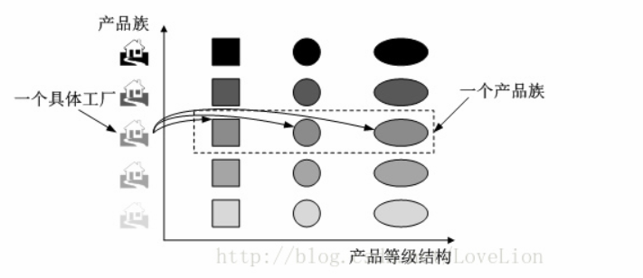
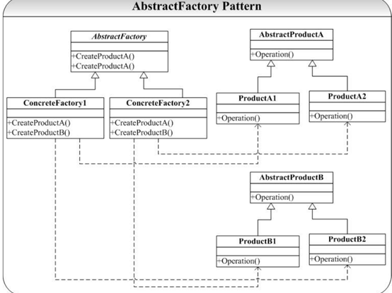

# 抽象工厂模式
## 解决问题
要创建一组相关或者相互依赖的对象  
在工厂方法模式中，我们使用一个工厂创建一个产品（产品继承于同一个父类），但有时候我们需要一个工厂可以创建多个产品对象，抽象工厂模式就是来解决这个问题的.AbstractFactory 模式关键就是将这一组对象的创建封装到一个用于创建对象的类（ConcreteFactory）中，维护这样一个创建类总比维护 n 多相关对象的创建过程要简单的多。  
在讲抽象工厂模式前，需要理清两个概念：  
产品等级结构：也就是产品的继承结构，例如一个为空调的抽象类，它有海尔空调、格力空调、美的空调等一系列子类  
产品族：在抽象工厂模式中，产品族指由同一个工厂生产的，位于不同等级结构中的一组产品。如海尔空调、海尔冰箱等海尔产品构成一个产品族  

## 类图
  

## 优点
添加新的工厂实习将会非常方便，只需要实现抽象工厂接口，再实现新的产品，就可以了，不需要修改以前的代码

## 问题
添加新的产品比较麻烦。如果需要添加一个新的产品，那么工厂接口和工厂具体实现类都要修改

## 使用场景
1. 一个系统不应该依赖于产品类实例被创建、组合和表达的细节
2. 系统有多于一个产品族时，而每次只使用一个产品族
3. 属于同一产品族的产品将在一起使用
4. 系统提供一个产品类库，所有产品以同样的接口出现，从而使客户端不依赖于具体的实现

