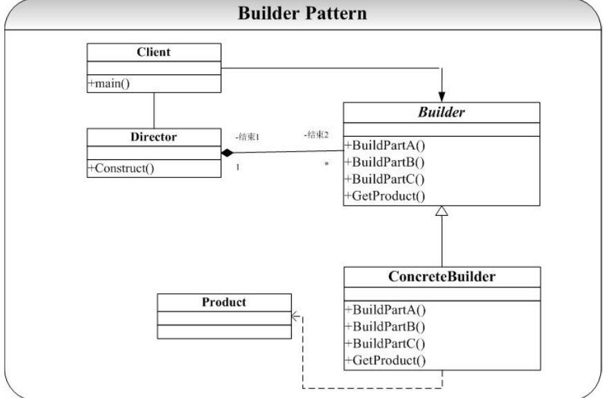

# Builder设计模式
## Builder 模式要解决的问题：
当我们要创建的对象很复杂的时候（通常是由很多其他的对象组合而成，比如Config、VO、PO、Entity...），我们要要复杂对象的创建过程和这个对象的表示（展示）分离开来，这样做的好处就是通过一步步的进行复杂对象的构建，由于在每一步的构造过程中可以引入参数，使得经过相同的步骤创建最后得到的对象的展示不一样。
## 类图
  

## 优点
1. 将复杂产品的创建步骤分解在不同的方法中，使得创建过程更加清晰  
2. 将产品的创建过程与产品本身分离开来，可以使用相同的创建过程来得到不同的产品，即细节依赖抽象  
