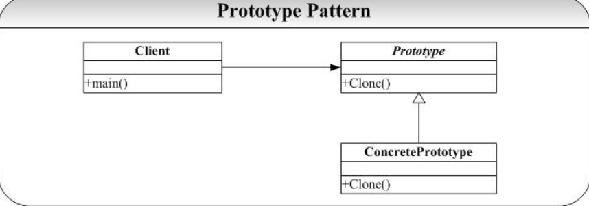

# Prototype-原型模式
## 概念
所谓原型模式就是用原型实例指定创建对象的种类，并且通过复制这些原型创建新的对象。  
说到原型模式，我们就不得不区分两个概念：深拷贝、浅拷贝。  
浅拷贝：使用一个已知实例对新创建实例的成员变量逐个赋值，这个方式被称为浅拷贝。  
深拷贝：当一个类的拷贝构造方法，不仅要复制对象的所有非引用成员变量值，还要为引用类型的成员变量创建新的实例，并且初始化为形式参数实例值。

## 类图
  

原型模式主要包含如下三个角色：  
Prototype：抽象原型类。声明克隆自身的接口。   
ConcretePrototype：具体原型类。实现克隆的具体操作。   
Client：客户类。让一个原型克隆自身，从而获得一个新的对象。  

## java中的clone
我们都知道Object是祖宗，所有的Java类都继承至Object，而Object类提供了一个clone()方法，该方法可以将一个java对象复制一份，因此在java中可以直接使用clone()方法来复制一个对象。但是需要实现clone的Java类必须要实现一个接口:Cloneable.该接口表示该类能够复制且具体复制的能力，如果不实现该接口而直接调用clone()方法会抛出CloneNotSupportedException异常。 
 
java中任何实现了Cloneable接口的类都可以通过调用clone()方法来复制一份自身然后传给调用者。一般而言，clone()方法满足：   
(1) 对任何的对象x，都有x.clone() !=x，即克隆对象与原对象不是同一个对象。   
(2) 对任何的对象x，都有x.clone().getClass()==x.getClass()，即克隆对象与原对象的类型一样。   
(3) 如果对象x的equals()方法定义恰当，那么x.clone().equals(x)应该成立。  

## 优点
1、如果创建新的对象比较复杂时，可以利用原型模式简化对象的创建过程，同时也能够提高效率。  
2、可以使用深克隆保持对象的状态。  
3、原型模式提供了简化的创建结构。  

## 缺点 
1、在实现深克隆的时候可能需要比较复杂的代码。  
2、需要为每一个类配备一个克隆方法，而且这个克隆方法需要对类的功能进行通盘考虑，这对全新的类来说不是很难，但对已有的类进行改造时，不一定是件容易的事，必须修改其源代码，违背了“开闭原则”。  