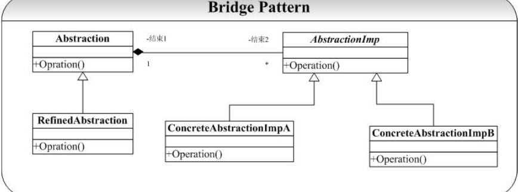

# Bridge-桥接模式
## 概念
桥接模式即将抽象部分与它的实现部分分离开来，使他们都可以独立变化。  
桥接模式将继承关系转化成关联关系，它降低了类与类之间的耦合度，减少了系统中类的数量，也减少了代码量。  
 桥接模式中的所谓脱耦，就是指在一个软件系统的抽象化和实现化之间使用关联关系（组合或者聚合关系）而不是继承关系，从而使两者可以相对独立地变化，这就是桥接模式的用意。  

## 类图
   

桥接模式主要包含如下几个角色：  
Abstraction：抽象类。   
RefinedAbstraction：扩充抽象类。   
Implementor：实现类接口。   
ConcreteImplementor：具体实现类 。  

在 Bridge 模式的结构图中可以看到，系统被分为两个相对独立的部分，左边是抽象部
分，右边是实现部分，这两个部分可以互相独立地进行修改  

## 优点
1. 分离抽象接口及其实现部分。提高了比继承更好的解决方案。  
2. 桥接模式提高了系统的可扩充性，在两个变化维度中任意扩展一个维度，都不需要修改原有系统。  
3. 实现细节对客户透明，可以对用户隐藏实现细节。  

## 缺点
1. 桥接模式的引入会增加系统的理解与设计难度，由于聚合关联关系建立在抽象层，要求开发者针对抽象进行设计与编程。 
2. 桥接模式要求正确识别出系统中两个独立变化的维度，因此其使用范围具有一定的局限性。

## 模式使用场景
1. 如果一个系统需要在构件的抽象化角色和具体化角色之间增加更多的灵活性，避免在两个层次之间建立静态的继承联系，通过桥接模式可以使它们在抽象层建立一个关联关系。
2. 对于那些不希望使用继承或因为多层次继承导致系统类的个数急剧增加的系统，桥接模式尤为适用。
3. 一个类存在两个独立变化的维度，且这两个维度都需要进行扩展。