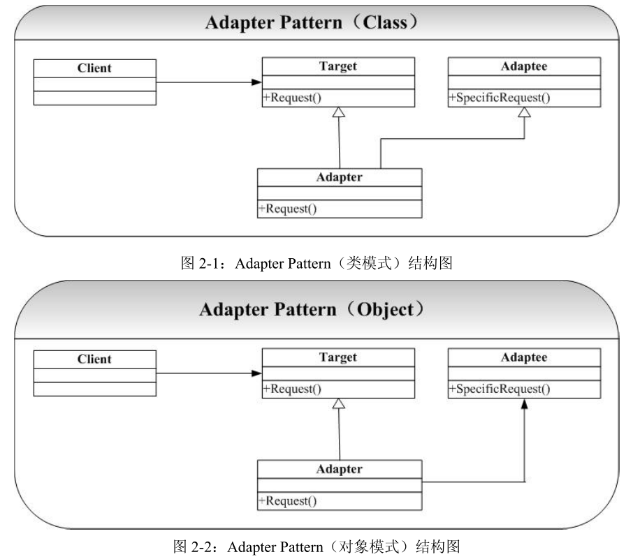

# Adapter-适配器模式
## 概念
适配器模式：将一个类的接口转换成客户希望的另一个接口。适配器模式让那些接口不兼容的类可以一起工作  
适配器模式的别名为包装器(Wrapper)模式，它既可以作为类结构型模式，也可以作为对象结构型模式。在适配器模式定义中所提及的接口是指广义的接口，它可以表示一个方法或者方法的集合。  

## 类图
     

在 Adapter 模式的结构图中可以看到，类模式的 Adapter 采用继承的方式复用 Adaptee
的接口，而在对象模式的 Adapter 中我们则采用组合的方式实现 Adaptee 的复用。  
由图可知适配器模式包含一下三个角色：  
1. Target(目标抽象类)：目标抽象类定义客户所需的接口，可以是一个抽象类或接口，也可以是具体类。在类适配器中，由于C#语言不支持多重继承，所以它只能是接口。  
2. Adapter(适配器类)：它可以调用另一个接口，作为一个转换器，对Adaptee和Target进行适配。它是适配器模式的核心。  
3. Adaptee(适配者类)：适配者即被适配的角色，它定义了一个已经存在的接口，这个接口需要适配，适配者类包好了客户希望的业务方法。  

## 优点：
1. 将目标类和适配者类解耦，通过引入一个适配器类来重用现有的适配者类，无需修改原有结构。  
2. 增加了类的透明性和复用性，将具体的业务实现过程封装在适配者类中，对于客户端类而言是透明的，而且提高了适配者的复用性，同一适配者类可以在多个不同的系统中复用。  
3. 灵活性和扩展性都非常好，通过使用配置文件，可以很方便的更换适配器，也可以在不修改原有代码的基础上 增加新的适配器，完全复合开闭原则。  

## 缺点：
1. 一次最多只能适配一个适配者类，不能同时适配多个适配者。  
2. 适配者类不能为最终类，在C#中不能为sealed类  
3. 目标抽象类只能为接口，不能为类，其使用有一定的局限性。

## 讨论
适配器模式，我觉得就是让目标类拥有被适配者的能力，但是这种能力不是一成不变的，需要让这种能力适合目标类的自身需求，即要做相应的调整。在我的例子中，chinese只会说中文，english只会说英文。但是通过适配器，当给chinese传入英文时，他就可以将英文转换成中文然后表达出来。