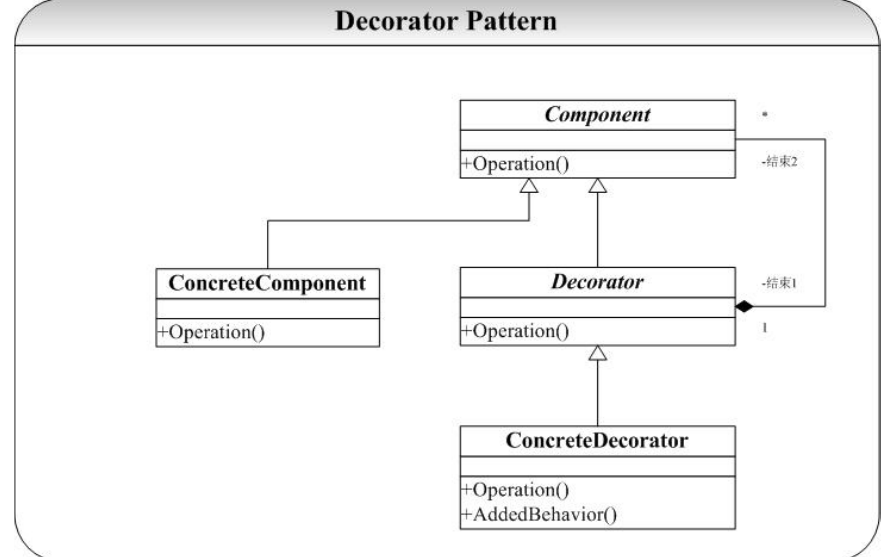

# Decorator-装饰者模式
## 概念
当我们需要为一个已经定义好的类添加新的职责（操作），通常的情况我们会给定义一个新类继承自定义好的类，这样会带来一个问题（将在本模式的讨论中给出）。通过继承的方式解决这样的情况还带来了系统的复杂性，因为继承的深度会变得很深。而 Decorator 提供了一种给类增加职责的方法，不是通过继承实现的，而是通过组合。装饰者模式是在已有功能的基础之上，动态地添加更多功能的一种方式，这些新加的代码装饰了原有类的 核心职责或主要行为。  

## 类图
  

参与者  
1. Component（被装饰对象的基类）定义一个对象接口，可以给这些对象动态地添加职责。  
2. ConcreteComponent（具体被装饰对象）定义一个对象，可以给这个对象添加一些职责。  
3. Decorator（装饰者抽象类）维持一个指向Component实例的引用，并定义一个与Component接口一致的接口。  
4. ConcreteDecorator（具体装饰者）具体的装饰对象，给内部持有的具体被装饰对象，增加具体的职责。  

## 优点
1. 把类中的装饰功能从类中搬除，可以简化原来的类  
2. 可以把类的 核心职责和装饰功能区分开来，结构清晰 明了并且可以去除相关类的重复的装饰逻辑。  