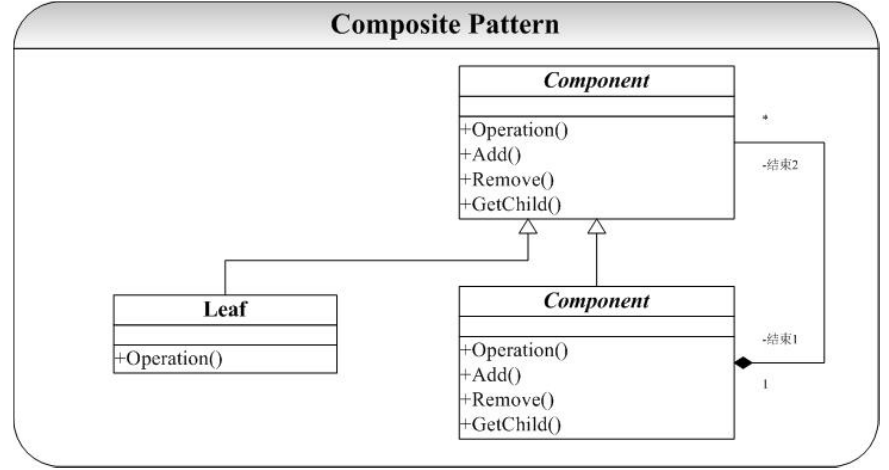

# composite-组合模式

## 概念
组合模式允许你将对象组合成树形结构来表现”部分-整体“的层次结构，使得客户以一致的方式处理单个对象以及对象的组合。  
组合模式实现的最关键的地方是——简单对象和复合对象必须实现相同的接口。这就是组合模式能够将组合对象和简单对象进行一致处理的原因。  

组合部件（Component）：它是一个抽象角色，为要组合的对象提供统一的接口。  
叶子（Leaf）：在组合中表示子节点对象，叶子节点不能有子节点。  
合成部件（Composite）：定义有枝节点的行为，用来存储部件，实现在Component接口中的有关操作，如增加（Add）和删除（Remove）。  
## 类图
  

## 优点

1. 组合模式使得客户端代码可以一致地处理对象和对象容器，无需关系处理的单个对象，还是组合的对象容器。  
2. 将”客户代码与复杂的对象容器结构“解耦。  
3. 可以更容易地往组合对象中加入新的构件。  

## 缺点
 使得设计更加复杂。客户端需要花更多时间理清类之间的层次关系。（这个是几乎所有设计模式所面临的问题）