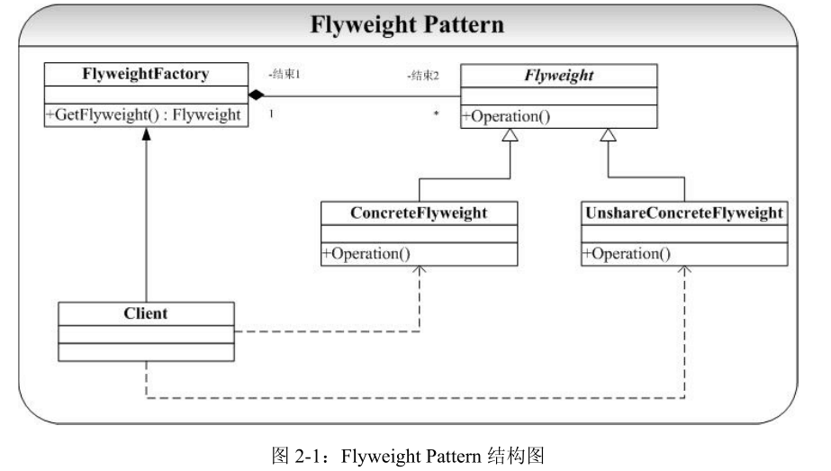

# Flyweight-享元模式

## 概念
面向对象可以非常方便的解决一些扩展性的问题，但是在这个过程中系统务必会产生一些类或者对象，如果系统中存在对象的个数过多时，将会导致系统的性能下降。对于这样的问题解决最简单直接的办法就是减少系统中对象的个数。  

享元模式提供了一种解决方案，使用共享技术实现相同或者相似对象的重用。也就是说实现相同或者相似对象的代码共享。  

所谓享元模式就是运行共享技术有效地支持大量细粒度对象的复用。系统使用少量对象,而且这些都比较相似，状态变化小，可以实现对象的多次复用。

共享模式是支持大量细粒度对象的复用，所以享元模式要求能够共享的对象必须是细粒度对象。

在了解享元模式之前我们先要了解两个概念：内部状态、外部状态。  
* 内部状态：在享元对象内部不随外界环境改变而改变的共享部分。  
* 外部状态：随着环境的改变而改变，不能够共享的状态就是外部状态。  

## 类图
  

享元模式存在如下几个角色：
* Flyweight: 抽象享元类。所有具体享元类的超类或者接口，通过这个接口，Flyweight可以接受并作用于外部专题 
* ConcreteFlyweight: 具体享元类。指定内部状态，为内部状态增加存储空间。 
* UnsharedConcreteFlyweight: 非共享具体享元类。指出那些不需要共享的Flyweight子类。 
* FlyweightFactory: 享元工厂类。用来创建并管理Flyweight对象，它主要用来确保合理地共享Flyweight，当用户请求一个Flyweight时，FlyweightFactory就会提供一个已经创建的Flyweight对象或者新建一个（如果不存在）。  

享元模式的核心在于享元工厂类，享元工厂类的作用在于提供一个用于存储享元对象的享元池，用户需要对象时，首先从享元池中获取，如果享元池中不存在，则创建一个新的享元对象返回给用户，并在享元池中保存该新增对象。

## 优点
1. 享元模式的优点在于它能够极大的减少系统中对象的个数。
2. 享元模式由于使用了外部状态，外部状态相对独立，不会影响到内部状态，所以享元模式使得享元对象能够在不同的环境被共享。

## 缺点
1. 由于享元模式需要区分外部状态和内部状态，使得应用程序在某种程度上来说更加复杂化了。
2. 为了使对象可以共享，享元模式需要将享元对象的状态外部化，而读取外部状态使得运行时间变长。

##  模式总结
1. 享元模式可以极大地减少系统中对象的数量。但是它可能会引起系统的逻辑更加复杂化。
2. 享元模式的核心在于享元工厂，它主要用来确保合理地共享享元对象。
3. 内部状态为不变共享部分，存储于享元享元对象内部，而外部状态是可变部分，它应当油客户端来负责。 