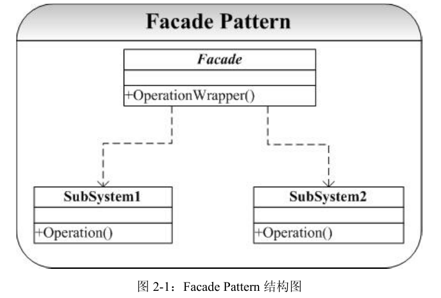

# Facade-外观模式

## 概念
外观模式（Facade）,他隐藏了系统的复杂性，并向客户端提供了一个可以访问系统的接口。这种类型的设计模式属于结构性模式。为子系统中的一组接口提供了一个统一的访问接口，这个接口使得子系统更容易被访问或者使用。   

不知道大家有没有比较过自己泡茶和去茶馆喝茶的区别，如果是自己泡茶需要自行准备茶叶、茶具和开水，如图1(A)所示，而去茶馆喝茶，最简单的方式就是跟茶馆服务员说想要一杯什么样的茶，是铁观音、碧螺春还是西湖龙井？正因为茶馆有服务员，顾客无须直接和茶叶、茶具、开水等交互，整个泡茶过程由服务员来完成，顾客只需与服务员交互即可，整个过程非常简单省事  

## 类图
  
Façade模式的想法、思路和实现都非常简单，但是其思想却是非常有意义的。并且Façade
设计模式在实际的开发设计中也是应用最广、最多的模式之一。  

外观模式包含如下两个角色：  
1. Facade（外观角色）：在客户端可以调用它的方法，在外观角色中可以知道相关的（一个或者多个）子系统的功能和责任；在正常情况下，它将所有从客户端发来的请求委派到相应的子系统去，传递给相应的子系统对象处理。  
2. SubSystem（子系统角色）：在软件系统中可以有一个或者多个子系统角色，每一个子系统可以不是一个单独的类，而是一个类的集合，它实现子系统的功能；每一个子系统都可以被客户端直接调用，或者被外观角色调用，它处理由外观类传过来的请求；子系统并不知道外观的存在，对于子系统而言，外观角色仅仅是另外一个客户端而已。

## 优点
* 松散耦合  
外观模式松散了客户端与子系统的耦合关系，让子系统内部的模块能更容易扩展和维护。
* 简单易用  
外观模式让子系统更加易用，客户端不再需要了解子系统内部的实现，也不需要跟众多子系统内部的模块进行交互，只需要跟外观类交互就可以了。
* 更好的划分访问层次  
通过合理使用Facade，可以帮助我们更好地划分访问的层次。有些方法是对系统外的，有些方法是系统内部使用的。把需要暴露给外部的功能集中到外观中，这样既方便客户端使用，也很好地隐藏了内部的细节。

