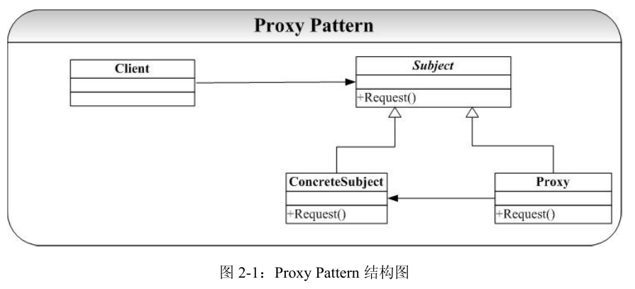

# Proxy-代理模式
## 概念
代理模式给某一个对象提供一个代理对象，并由代理对象控制对原对象的引用。通俗的来讲代理模式就是我们生活中常见的中介。  

我们有多种不同的方式来实现代理。如果按照代理创建的时期来进行分类的话， 可以分为两种：静态代理、动态代理。静态代理是由程序员创建或特定工具自动生成源代码，在对其编译。在程序员运行之前，代理类.class文件就已经被创建了。动态代理是在程序运行时通过反射机制动态创建的。

## 类图
  

## 优点
可以做到在符合开闭原则的情况下对目标对象进行功能扩展。

## 缺点
我们得为每一个服务都得创建代理类，工作量太大，不易管理。同时接口一旦发生改变，代理类也得相应修改。   